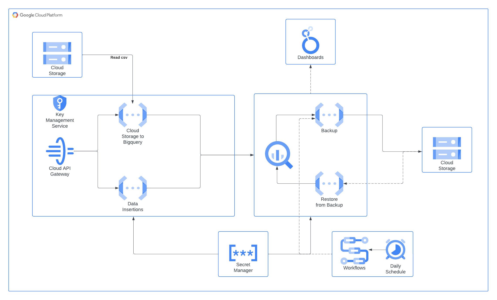

# Data Migration and Management System (Challenge)

# Overview

This project provides a comprehensive solution for data management within Google Cloud Platform (GCP). It utilizes various GCP services to ensure efficient handling of data operations such as data insertion, data loading from CSV files, and data backup and restoration with a focus on scalability and security.

## Architecture

The solution architecture is built around several key Google Cloud services:

* **Google Cloud Storage (GCS):** Used for storing backup files in AVRO format.
* **BigQuery:** Serves as the data warehouse for storing and querying data.
* **Cloud Functions:** Used to implement business logic for data operations such as inserting data into BigQuery and exporting/importing BigQuery tables.
* **API Gateway:** Manages and secures access to the Cloud Functions, ensuring that only authorized requests can trigger these functions. Also limits the amount of requests that can be made to each API endpoint.
* **Google Cloud Scheduler and Workflows:** Automate and schedule tasks like data backup and enable manual triggers for data restoration.
* **Secret Manager:** Securely manages and accesses secrets like API keys and database configurations.
* **Looker Studio:** Provide dynamic, interactive dashboards and visualizations directly sourced from BigQuery views.

## Workflow

### Data Insertion and Loading

* **Data Insertion via API:** Users can insert data directly into BigQuery tables using a REST API, secured by an API key. The API validates incoming data against predefined schemas before insertion.

* **CSV File Loading:** Users upload CSV files to a designated GCS bucket. A Cloud Function triggers on file upload, processes the CSV file, and loads the data into BigQuery.

### Data Backup and Restoration

* **Automated Backups:** Scheduled via Cloud Scheduler, backups are performed automatically every day at 8:00 AM (there's also a possibility to execute it manually). Workflows coordinate the backup process, calling a Cloud Function that exports BigQuery tables to AVRO format in GCS.

* **Manual and Scheduled Restorations:** Users can trigger data restoration manually through a Workflow, which calls a Cloud Function to restore tables from the most recent AVRO files in GCS.

## Detailed Service Descriptions

### API Gateway
The API Gateway fronts two main endpoints:

* **/load_csv:** Accepts POST requests to load data from CSV files into BigQuery.
* **/insert_data:** Accepts POST requests to insert data directly into BigQuery tables.

### Cloud Functions

* **Data Loading:** Parses CSV files from GCS and loads them into BigQuery.
* **Data Insertion:** Validates and inserts data received via API into BigQuery.
* **Backup and Restore:** Handles the exporting of BigQuery tables to AVRO files for backups and imports AVRO files into BigQuery for restoration.

### Google Cloud Workflows

Coordinates complex operations like backups and restorations, ensuring they execute in the correct order and handle errors gracefully.

## Dashboards

Looker Studio is integrated into the solution to provide dynamic, interactive dashboards and visualizations directly sourced from BigQuery views. This allows for real-time data analysis and more informed decision-making.

https://lookerstudio.google.com/reporting/ea42b099-497d-428a-9fbf-7c7d4ec76e3c

## References

* https://beranger.medium.com/rate-limit-google-cloud-functions-with-api-gateway-19b54bb9d9e9

