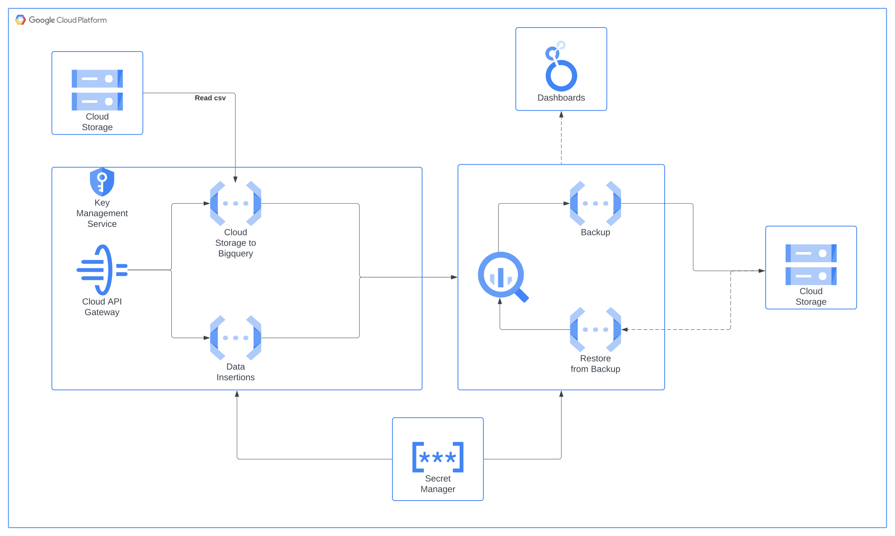

# ETLwithGCP

# Overview




## Creating the BigQuery tables
```SQL
CREATE TABLE IF NOT EXISTS ODS_ORG_MIGRATION.hired_employees (
  id              INT64,
  name            STRING,
  datetime        STRING,
  department_id   INT64,
  job_id          INT64
)
OPTIONS(labels=[('process', 'migration')]);


CREATE TABLE IF NOT EXISTS ODS_ORG_MIGRATION.departments (
  id              INT64,
  department      STRING
)
OPTIONS(labels=[('process', 'migration')]);


CREATE TABLE IF NOT EXISTS ODS_ORG_MIGRATION.jobs (
  id              INT64,
  job            STRING
)
OPTIONS(labels=[('process', 'migration')]);
``` 


## References

* https://beranger.medium.com/rate-limit-google-cloud-functions-with-api-gateway-19b54bb9d9e9


